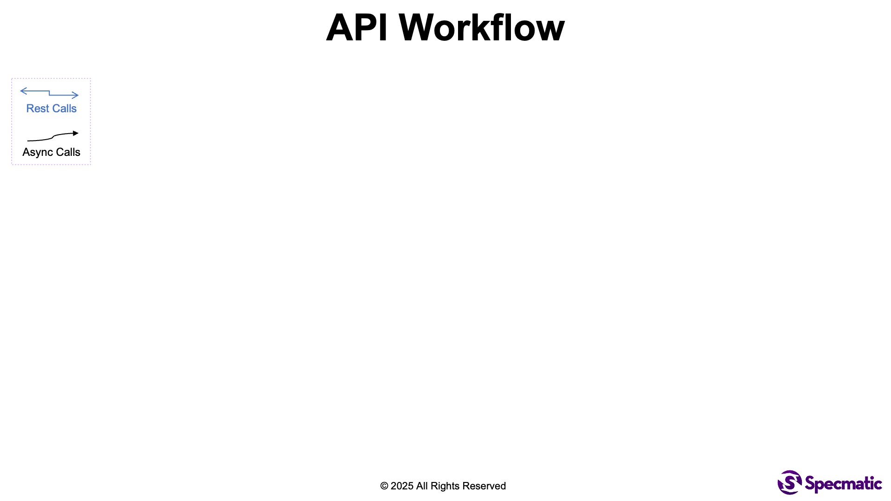
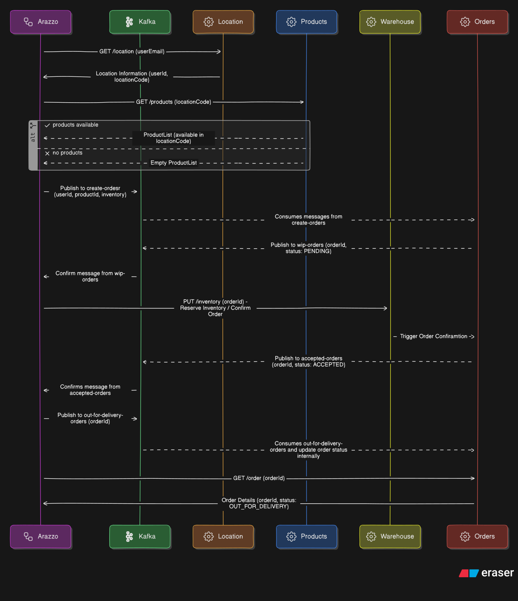

# **From REST to Events: API Workflow Testing and Mocking with a Single Arazzo Spec**

APIs rarely work in isolation. Real-world usage involves multiple steps across both synchronous REST calls and asynchronous events, where the outcome of each step determines the journey a particular interaction takes. While testing individual endpoints is necessary, it's not sufficient. It is equally important to validate how those endpoints and events work together as part of a real workflow.

Enter the [Arazzo Specification](https://www.openapis.org/arazzo-specification) V1.1, which describes complete workflows including inputs, outputs, step dependencies, and success/failure criteria, across [OpenAPI](https://www.openapis.org/) (REST) and [AsyncAPI](https://www.asyncapi.com/) (events). In this sample project, we'll demonstrate how you can leverage [Specmatic Arazzo](https://specmatic.io/features/author-test-arazzo-api-workflows-drag-drop-simplicity/) to drive end-to-end API workflow testing and mocking in a completely no-code manner.

You will learn how Arazzo + Specmatic enables shift-left testing of entire API journeys, spanning both sync and async operations. You'll see how mocking complete workflows can unblock frontend teams, simulate event-driven flows, and accelerate CI pipelines. The session will also walk through the full lifecycle of how we design a multi-step journey, author or generate an Arazzo spec to capture it, and ensure both providers and consumers adhere to the same contract; thereby enabling independent, parallel development and deployment of services and components in complex, event-driven microservice architectures.

This repository showcases a microservices-based architecture for product retrieval, order placement, inventory reservation, and order lifecycle management. The system uses a hybrid model of synchronous REST calls and asynchronous Kafka-based event processing to achieve scalability, resilience, and loose coupling.

---

## 📋 Prerequisites

Ensure the following are installed:

* **Specmatic Studio**
- [https://www.docker.com/products/docker-desktop/](https://hub.docker.com/r/specmatic/specmatic-studio)

* **Container Management Applications**
- [Docker Desktop, Podman Desktop, Rancher Desktop, or Colima](https://docs.specmatic.io/references/docker_images.html#docker-desktop-alternatives)

---

## 🗺 API Workflow



## 🗺 Sequency Diagram



---

## 🔧 Setup

### Clone the project

```shell
git clone https://github.com/specmatic/specmatic-arazzo-openapi-asyncapi-sample
cd specmatic-arazzo-openapi-asyncapi-sample
```

---

## 🚀 Running the Project

Start the full stack using Docker Compose:

```shell
docker compose up --build
```

This launches the following services:

| Service           | Port | Description                    |
| ----------------- | ---- | ------------------------------ |
| **Location API**  | 3000 | Provides user location details |
| **Products API**  | 3001 | Returns products by location   |
| **Order API**     | 3002 | Handles order lifecycle        |
| **Warehouse API** | 3003 | Manages inventory operations   |
| **Kafka**         | 9092 | Internal broker port           |
| **Postgres**      | 5432 | Shared database                |

---

## 🧩 Components

### **Location Service**

* Provides user-specific location details.
* Serves as the authoritative source for user–location mapping.

### **Products Service**

* Fetches products based on a location code.
* Validates product availability before ordering.

### **Order Service**

* Consumes events from Kafka (e.g., `create-orders`).
* Manages the order lifecycle (PENDING → ACCEPTED → OUT_FOR_DELIVERY).
* Publishes order updates back to Kafka.

### **Warehouse Service**

* Reserves and confirms inventory for incoming orders.
* Sends updates back to the Order Service through Kafka.

### **Kafka**

* Backbone for event-driven communication.
* Decouples services for scalable, fault-tolerant workflows.

---

## 🔌 Communication Model

### **Synchronous REST Calls**

Used for immediate operations:

* Fetching location details
* Retrieving available products
* Getting final order status

### **Asynchronous Kafka Events**

Used for background or long-running workflows:

* Order creation
* Inventory reservation
* Delivery status updates

This combination supports resilience, scalability, and eventual consistency.

---

## 📦 Kafka Topics

| Topic                     | Purpose                                    |
| ------------------------- | ------------------------------------------ |
| `create-orders`           | Initiates the order creation workflow      |
| `wip-orders`              | Orders pending inventory confirmation      |
| `accepted-orders`         | Orders successfully confirmed and reserved |
| `out-for-delivery-orders` | Delivery dispatch and tracking workflow    |
